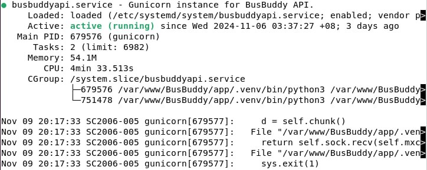

# BusBuddy Automated Deployment System

This backend API is powered by Flask.

# Table of Contents
- [Technical Stuff](#tech-stuff)
  - [Important Constraints](#important-constraints)
- [Setup Instructions](#setup-instructions)
  - [Deploying as Service](#deploying-as-service)
- Other README Directories
  - [Main](../README.md)
  - [Frontend](../appfront/README.md)
  - [Backend](../app/README.md)


# Tech Stuff

## Important Constraints
- Backend HAS to be running before ADS can be deployed. This ensures there will not unnecessary failed API requests.
- To keep ADS running, a browser running the ADS deployed port has to be kept open on the page

# Setup Instructions
- First, ensure you are in ADS directory.
```
$ cd /var/www/BusBuddy/ads
```
- Use the virtual environment from section 4 to run the app.
```
$ sudo ../app/.venv/bin/python3 ads.py
```
- Now, it will be deployed on http://localhost:1234.
- A separate local browser is required to be open on the above URL to keep the system up and running.

## Deploying as Service
## Backend and Automated Deployment System
- Change the following first:
  - ```
    $ sudo nano /var/www/BusBuddy/ads/ads.py
    ```
  - Change the `api_link` at the top of the file to `http://<your VM's IP address>:8080/forads`.
- First, install gunicorn in the virtual environment.
```
$ sudo ../app/.venv/bin/pip install gunicorn
```
- Write a service file and name it `ads.service` for the backend API. `ads` can be replaced with the name you like, but
  that is what will be referred to for this document.
```
$ sudo nano /etc/systemd/system/ads.service
```
- Into the file, insert the following.
```
[Unit]
Description=Gunicorn instance for Automated Deployment System.
After=network.target
[Service]
User=VMadmin
Group=www-data
WorkingDirectory=/var/www/BusBuddy/ads
ExecStart=/var/www/BusBuddy/app/.venv/bin/gunicorn -b <VM IP address>:1234 ads:app
Restart=always
[Install]
WantedBy=multi-user.target
```
- To start the service, run the following:
```
$ sudo systemctl start ads
$ sudo systemctl enable ads
$ sudo systemctl status ads
```
- After the last line, it should show that the service is running. It should be running on local port 1234.

